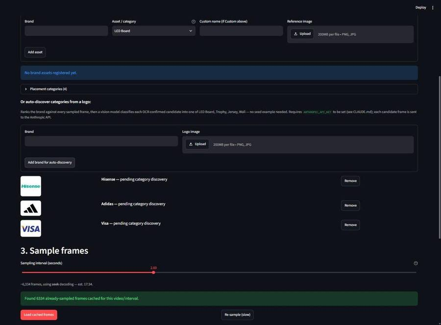
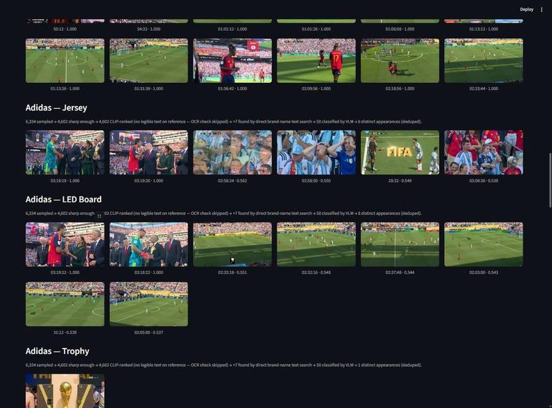
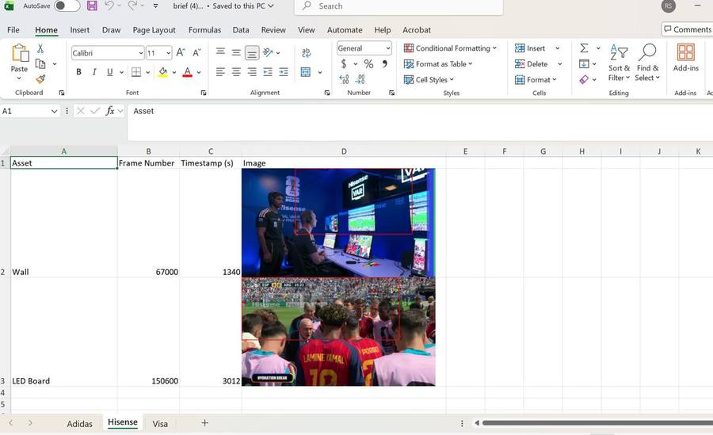
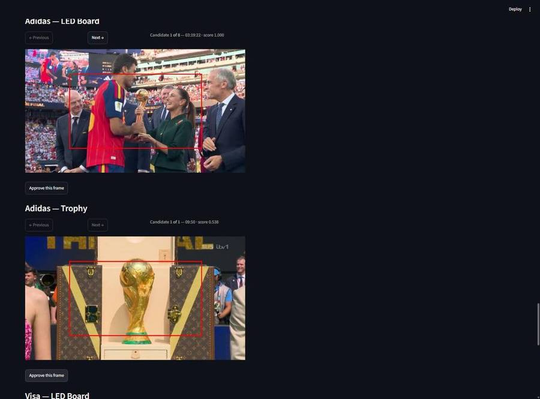

# SBAA — Sport Brand Annotation Assistant

Given a full match broadcast and a brand's logo, SBAA finds the frames where that brand actually
appeared on screen, works out what kind of placement each appearance is (perimeter board, jersey,
trophy, backdrop wall), and hands the analyst a short list to confirm.

It replaces a manual process: scrubbing a three-hour match frame by frame, logging where each
sponsor showed up, and pasting screenshots into a spreadsheet. The output is deliberately small —
**two approved example frames per placement**, each with a box drawn round the branding, exported
as an Excel workbook for the ML team's downstream exposure-value scan.

## What a run looks like

You give it a brand name and a logo file. No category, no example crop from the match:



One real pass, three logos in, six placements found — nobody specified a category:

| Brand | Reference logo | Placements discovered | Appearances |
| --- | --- | --- | --- |
| Hisense | Wordmark | LED Board, Wall | 22, 2 |
| Adidas | Graphic mark, no text | Jersey, LED Board, Trophy | 6, 8, 1 |
| Visa | Wordmark | LED Board | 23 |



*Adidas from a bare three-stripe mark with no readable text — still separated into three placement
types, each with its own candidate list.*

Narrowing 633,325 broadcast frames down to 23 candidates for Visa:

```
6,334 sampled (1 every 2s) → 4,602 sharp enough → ranked by CLIP similarity
→ top 50 OCR-checked → 4 confirmed → +140 found by searching frame text for "Visa"
→ 50 classified by a vision model → 23 distinct appearances
```

Each stage is cheaper than the one after it. That is the whole design, and it comes from the
hardware: this was built on a machine with **no usable GPU**, so nothing can afford to look at
every frame twice.

## Quick start

```bash
python -m venv .venv
./.venv/Scripts/python.exe -m pip install -r requirements.txt
```

On a GPU-less machine, install torch from the CPU-only index first to avoid pulling multi-GB CUDA
packages:

```bash
./.venv/Scripts/python.exe -m pip install torch --index-url https://download.pytorch.org/whl/cpu
```

Auto-discovery calls the Anthropic API, so it needs a key:

```bash
export ANTHROPIC_API_KEY=sk-ant-...        # or put it in a project-root .env
```

`src/sbaa/vlm.py` loads a project-root `.env` on first use, but **does not override a key already
in the environment** — so a stale value in `.env` is silently ignored when your shell exports one,
and vice versa. Without a key the app still runs; the auto-discover form warns and no-ops, and
manual assets skip the vision-model check.

Drop a match video into `sample_data/video/` (it is read from disk, not uploaded — match files run
to several GB), then:

```bash
./.venv/Scripts/python.exe -m streamlit run app.py
```

Sampling a full match takes tens of minutes. To do it ahead of time instead of blocking the
session, run it offline — it writes to the same cache the app reads:

```bash
./.venv/Scripts/python.exe scripts/sample_video.py <video-file-or-name> --interval 2.0
```

## The six steps

1. **Match video** — pick a file already on disk.
2. **Brand assets** — register a brand and asset manually, or drop in a logo and let auto-discovery
   work out the placement types. The placement taxonomy is editable here, and each category carries
   a description that is sent to the model verbatim.
3. **Sample frames** — one frame every N seconds, cached per video and interval.
4. **Rank** — the funnel above, per brand.
5. **Review & approve** — page through candidates, draw a box, approve at most two per placement.
6. **Export** — one Excel workbook, one sheet per brand.



*The deliverable: asset, frame number, timestamp and the frame with the analyst's box burned in.*

## Layout

```
app.py                  Streamlit UI, all six steps
src/sbaa/
  video.py              sampling, decode-strategy calibration, blur filter
  retrieval.py          CLIP embedding + ranking, text search, merge, de-duplication
  ocr.py                text detection, fuzzy brand-name matching, per-frame cache
  vlm.py                vision-model placement classification (Anthropic API)
  category.py           the placement taxonomy: names plus their descriptions
  progress.py           per video+interval persistence of assets, rankings, approvals
  export.py             the Excel brief
scripts/sample_video.py offline sampling
```

## Data on disk

| Path | Tracked? | Safe to delete? |
| --- | --- | --- |
| `sample_data/video/` | No | Yes — but never commit broadcast footage |
| `sample_data/reference_images/` | Yes | It's the logo library |
| `data/cache/` | No | Yes, regenerable (slowly) |
| `data/uploads/` | No | Yes, regenerable |
| `data/progress/` | No | **No** — holds the analyst's approvals, which exist nowhere else |
| `data/categories.json` | No | Cheap to retype, but losing it reverts the taxonomy |

## Status

This is a **prototype**, and its limits are load-bearing rather than incidental:

- The vision model gets things wrong confidently — in one run it classified a Louis Vuitton trophy
  trunk as an Adidas placement. **Nothing is accepted automatically**; the Step 5 analyst review is
  the intended backstop, not a formality.

  

  *A real false positive, surfaced at score 0.538. There is no Adidas branding in that frame.*

- There is no automatic bounding box. An open-vocabulary detector was tested and failed completely
  on perimeter boards and jerseys, so the analyst draws every box by hand.
- Reading the brand name out of frame text does most of the recall work. That suits static signage;
  it transfers poorly to small, curved, motion-blurred marks on a moving car.
- One app, one laptop, one video at a time. No queue, no users, no test suite.

Validate changes to `src/sbaa/` against a real file in `sample_data/video/` — the decode-cost
tradeoffs only show up against real footage. A compile check after edits:

```bash
./.venv/Scripts/python.exe -m py_compile app.py src/sbaa/*.py
```

## Further reading

[`CLAUDE.md`](CLAUDE.md) is the engineering log: why the pipeline is staged the way it is, what was
tried and rejected (an open-vocabulary detector, CLIP zero-shot category prompts, a bigger embedding
model), and the failure modes found in real use. Read it before changing the retrieval path.
